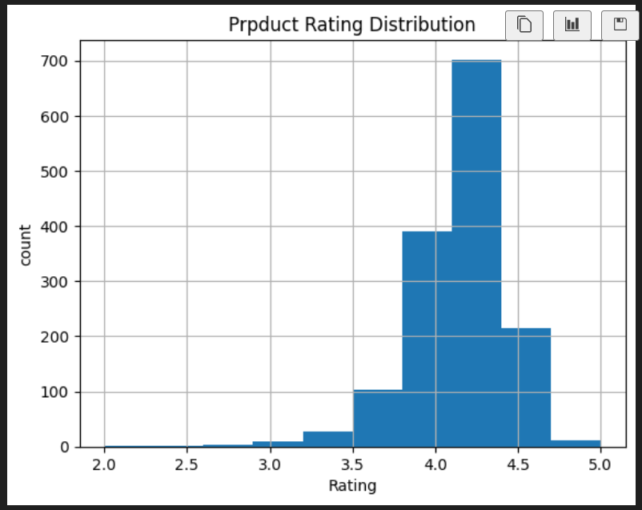
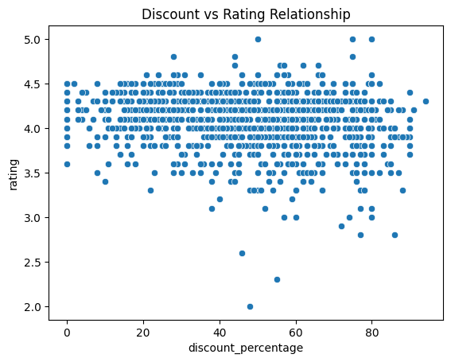

# Amazon Sales Data Analysis

This project performs Exploratory Data Analysis (EDA) on an Amazon product dataset using Python.

## Tools Used
- Python
- Pandas
- Matplotlib
- Seaborn

## Project Overview
The dataset contains information about Amazon products including product name, category, rating, discount percentage and review details.

The objective of this project is to analyze product ratings and discount patterns to derive useful business insights.

## Analysis Performed
- Data cleaning and preprocessing
- Rating distribution analysis
- Discount percentage analysis
- Discount vs Rating relationship visualization
- Category distribution analysis

## Key Insights
- Most products have ratings between **4.0 and 4.5**
- Several products offer **high discounts above 80%**
- Discount percentage shows **weak correlation with product ratings**

## Visualizations

### Rating Distribution

### Discount vs Rating Relationship

## Dataset
Amazon product dataset used for analysis.

## Author
Venkatesh
